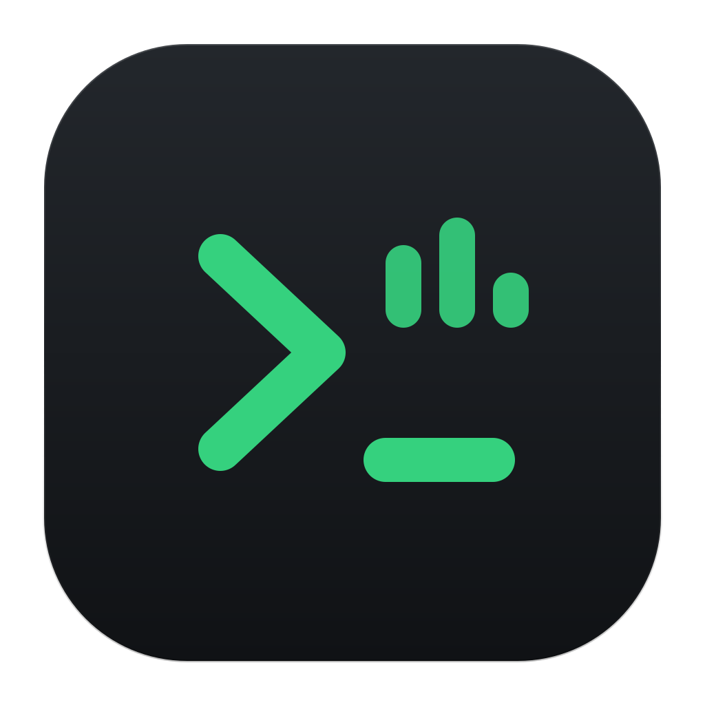
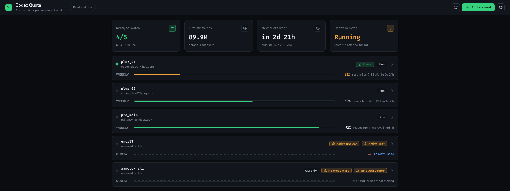
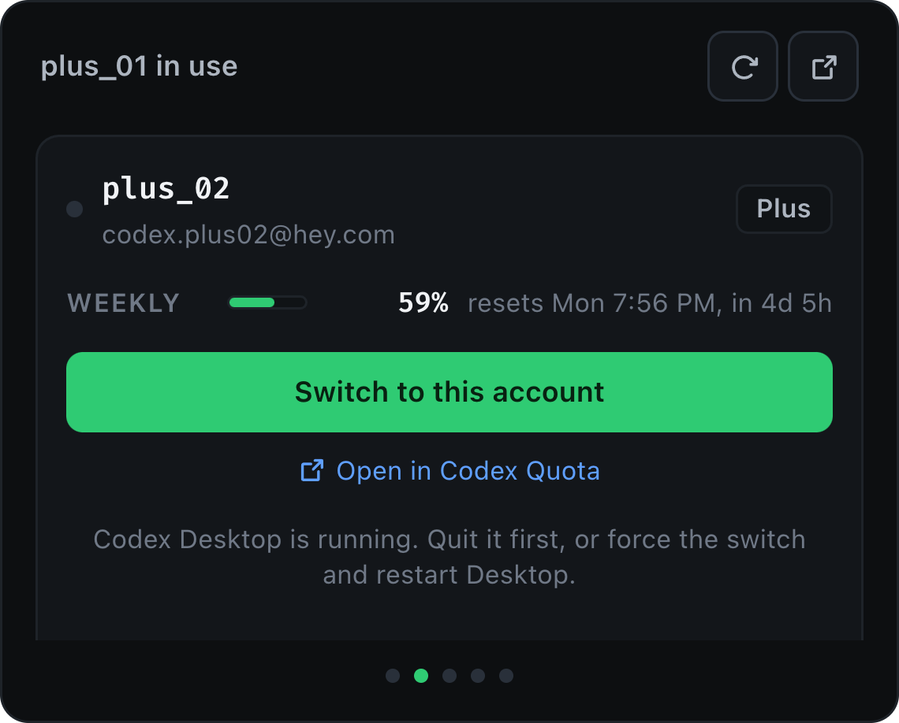

<div align="center">



# Codex Quota

**Run several Codex accounts without repeating the logout-and-login dance.**

[](https://github.com/Ldsystem/CodeX-Quota-Desktop/releases/latest)
[](https://github.com/Ldsystem/CodeX-Quota-Desktop/actions/workflows/release.yml)
[](LICENSE)
[](https://github.com/Ldsystem/CodeX-Quota-Desktop/releases/latest)



</div>

Codex Desktop signs in one account at a time. If you hold more than one subscription, switching means signing out, signing in, and finding out only afterwards whether the account you picked had any quota left.

Codex Quota keeps each account's credentials in its own profile, shows every account's remaining quota side by side, and switches the live credential in one click — backing up what was there before it does.

## Features

- **Every account's quota at a glance.** Plan, remaining percentage, reset time and available reset credits, fetched per account in the background so nothing blocks.
- **Lives in the menu bar.** The icon carries the headroom you have left, and its panel holds a swipeable card per account with an Activate button on each one.
- **One-click switching.** Move the live Codex credential to any account, with the previous one backed up automatically.
- **Honest state.** If something moved `~/.codex/auth.json` outside the app, that account reads as drifted rather than pretending to be live.
- **Token history.** Lifetime tokens, daily activity, streaks and longest run, straight from your Codex profile.
- **Quota window priming.** Start an account's window from a moment you choose with one minimal billed request, instead of waiting for whenever you next happen to use it.
- **Full account lifecycle.** Add, sign in, sign out, import the live credential, delete stored credentials, remove accounts.

> [!NOTE]
> This is a full port of the [CodeX-Quota](https://github.com/Ldsystem/CodeX-Quota) bash CLI into TypeScript. It reads and writes the same files, so the two can be used interchangeably on the same machine.

## The menu bar

Closing the window does not quit the app. The icon stays, showing the headroom left on the account in use, or the best account to switch to marked with an arrow when nothing is in use. Clicking it opens a panel you can swipe through, one card per account, and switching from a card is a single click — the same guard applies as in the window, so switching under a running Codex Desktop asks first.




The panel keeps reading quota while it is hidden, which is what keeps the figure beside the icon honest. Right-clicking the icon offers the window, a refresh, a start-at-login switch, and quit. Settings has the same switch plus one to hide the Dock icon entirely.

## Coming from the CLI

Every command has a counterpart in the interface, with two exceptions worth knowing before you switch.

| CLI command | Where it went |
| --- | --- |
| `status`, `list` | The account rows, with meter, plan, reset time and warnings |
| `add`, `remove` | Add account dialog; remove from the account page, behind a confirmation |
| `login`, `logout` | Sign in and sign out on the account page |
| `activate` | Switch Codex Desktop, guarded by the running-app check and the backup |
| `import-active` | Import the live credential, per account |
| `delete-auth` | Delete stored credential, for Desktop-switching profiles |
| `start-5h` | Start the quota window |
| `use` | Not implemented |

Codex no longer enforces a rolling 5-hour limit, so only the subscription window is tracked; `start-5h` keeps its real purpose, priming that window, under a name not tied to a bucket that no longer exists. Running an arbitrary command under a profile home, which `use` did, has no interface counterpart — keep the CLI around if you need it.

## Install

Download the latest DMG from the [releases page](https://github.com/Ldsystem/CodeX-Quota-Desktop/releases/latest), open it, and drag **Codex Quota** to Applications.

The build is signed ad-hoc rather than with a Developer ID, so a downloaded copy arrives quarantined and Gatekeeper will refuse it until you either right-click → Open once, or clear the flag:

```bash
xattr -dr com.apple.quarantine "/Applications/Codex Quota.app"
```

> [!IMPORTANT]
> Apple silicon only, and there is no auto-update — download a newer DMG to upgrade.

## Requirements

- macOS on Apple silicon.
- Codex Desktop, for the credential this app switches.
- The `codex` CLI on your `PATH`, used for signing in and out and for priming a quota window. Nothing is bundled; the app runs the install you already trust.

## How it works

Each account gets a profile directory holding its own `auth.json`. Switching copies that credential into the location Codex Desktop reads, after backing up the credential already there.

```
~/.codex-quota/
  accounts.txt          the accounts you have registered
  accounts/<name>/      per-account auth.json and profile.json
  backups/              the live credential as it was before each switch
  active.json           which account the live credential belongs to
~/.codex/auth.json      the credential Codex Desktop actually reads
```

Quota comes from the same endpoints Codex itself uses, authenticated with each account's own token: the usage endpoint for the live allowance, and the profile endpoint for token history. Expired access tokens are refreshed on read.

> [!TIP]
> Codex Desktop caches the credential at startup. After switching, restart it before expecting the new account to be in effect.

## Configuration

Everything has a working default; these are the escape hatches.

| Variable | Purpose |
| --- | --- |
| `CODEX_QUOTA_CODEX_BIN` | The `codex` to run, when the search finds the wrong one or none |
| `CQ_HTTP_PROXY` | Proxy for API calls; `off` disables the default `http://127.0.0.1:7897` |
| `CQ_QUOTA_USAGE_URL` | Override the usage endpoint |
| `CQ_START_5H_MODEL` | Model used to prime a quota window (default `gpt-5.4-mini`) |
| `CQ_START_5H_REASONING_EFFORT` | Reasoning effort for that request (default `low`) |

Settings shows the resolved paths, the proxy, and which `codex` was found.

## Development

Node 22 or newer, and pnpm. Node 20 cannot load `undici@8`, which the tests need; the packaged app is unaffected because Electron embeds its own Node.

```bash
pnpm install
pnpm dev        # Electron with hot reload
pnpm dev:web    # Renderer only, in a browser, on fixture data
pnpm test
pnpm typecheck
pnpm dist       # arm64 .dmg and .zip in release/
```

`pnpm dev:web` runs the interface against an in-memory fixture service, so layout and states can be worked on without touching real credentials. The menu bar panel is a second page on the same server, at `/panel.html`.

```
src/
  main/        Electron main process: files, HTTP, spawning codex, tray and panel
  preload/     Context bridge
  shared/      Domain model, the service contract, and the shell contract
  renderer/    React interface: the window and the menu bar panel
```

## Releasing

Pushing a `v*` tag builds on a GitHub-hosted Apple silicon runner and publishes the DMG and zip to a release. No secrets are involved: the bundle is signed ad-hoc and the run's own token creates the release.

```bash
gh workflow run Release   # rehearse: builds and uploads an artifact, publishes nothing
git tag v0.1.1 && git push origin v0.1.1
```

The job stops before publishing anything if the runner is not arm64, if the tag disagrees with the version in `package.json`, or if the packed bundle's signature does not verify.
